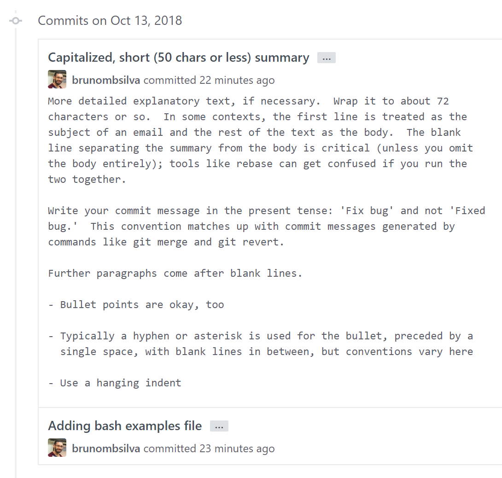

title: Git Advanced Topics

class: inverse
layout: true
---
class: center, middle

# Git Advanced Topics
[brunombsilva]

---
# Agenda

* Commit Messages
* Rebasing
* Splitting Commits
* Merge vs Rebase
* Stash
* Patches
* Git Configuration
* Other Tools

---
# Commit Messages

```terminal
bmbs@demo ~ $ git log --oneline
56e65d1 .
37283a2 this is a reeaaaaallllyyyyy long description that may becode hard to read or even cut in GitHub UI
ac1ba68 third time's the charm
97f4739 fixing!
7869959 creating notes
```

---
# Sugested Approach

* Separate subject from body with a blank line
* Do not end the subject line with a period
* Capitalize the subject line and each paragraph
* Use the imperative mood in the subject line
* Wrap lines at 72 characters
* Use the body to explain what and why you have done something. In most cases, you can leave out details about how a change has been made.

---
# Example

```markdown
Capitalized, short (50 chars or less) summary

More detailed explanatory text, if necessary.  Wrap it to about 72
characters or so.  In some contexts, the first line is treated as the
subject of an email and the rest of the text as the body.  The blank
line separating the summary from the body is critical (unless you omit
the body entirely); tools like rebase can get confused if you run the
two together.

Write your commit message in the present tense: 'Fix bug' and not 'Fixed
bug.'  This convention matches up with commit messages generated by
commands like git merge and git revert.

Further paragraphs come after blank lines.

- Bullet points are okay, too

- Typically a hyphen or asterisk is used for the bullet, preceded by a
  single space, with blank lines in between, but conventions vary here

- Use a hanging indent
```

---

# In GitHub



---
# Command Line

```terminal
bmbs@demo ~ $ git commit -m "First line
dquote>
dquote> Second more descriptons line.
dquote>
dquote> - list line 1
dquote>
dquote> - list line 2"
```

---
# Iterative rebase

After the mess is done...

```terminal
bmbs@demo ~ $ git rebase -i master
pick c69ab52 creating notes
pick 83b35dc fixing!
pick 506e44b Third time's the charm
pick 0c50e97 this is a reeaaaaallllyyyyy long description that may become hard to read or even cut in GitHub UI
pick b34be5a .

# Rebase 4ca3a3f..b34be5a onto 4ca3a3f (5 command(s))
#
# Commands:
# p, pick = use commit
# r, reword = use commit, but edit the commit message
# e, edit = use commit, but stop for amending
# s, squash = use commit, but meld into previous commit
# f, fixup = like "squash", but discard this commit's log message
# x, exec = run command (the rest of the line) using shell
# d, drop = remove commit
#
# These lines can be re-ordered; they are executed from top to bottom.
```

---
class: center, middle
# Iterative rebase
[demo | [run 01-messy-history.sh](./git-advanced-topics/01-messy-history.sh)]

---
# git commit --amend

Particular iterative rebase case:

```terminal
bmbs@demo ~ $ git log --oneline master...
a804492 last commit message

bmbs@demo ~ $ echo "missing from last commit" >> file.txt
bmbs@demo ~ $ git add file.txt
bmbs@demo ~ $ git commit --amend

bmbs@demo ~ $ git log --oneline master...
a804492 last commit message
```

---
# Splitting commits

You've commited 2 unrelated changes in the one commit. Now what?

```terminal
bmbs@demo ~ $ git rebase -i master
pick cdde897 Adding Spanish greeting
edit d675849 Adding Portuguese greeting
pick 5f18447 creating notes

bmbs@demo ~ $ git reset HEAD~1

bmbs@demo ~ $ git add file1.txt
bmbs@demo ~ $ git commit -m "File 1"

bmbs@demo ~ $ git add file2.txt
bmbs@demo ~ $ git commit -m "File 2"

bmbs@demo ~ $ git rebase --continue

bmbs@demo ~ $ git log --oneline master...
cdde897 Adding Spanish greeting
dd24ace File 1
ace23ab File 2
5f18447 creating notes
```

---
# Rebase vs Merge

Master has changed since you've created your branch. Now what?

```terminal
bmbs@demo ~ $ git checkout master
bmbs@demo ~ $ git pull origin master
bmbs@demo ~ $ git checkout my-branch
bmbs@demo ~ $ git rebase master # git merge master
```

* Keeping history clean
 * each branch includes only it's relevant commits
* Ensuring your changes still make sense given base branch changes

---
class: center, middle
# Rebase vs Merge
[demo | [run 02-merge-rebase.sh](./git-advanced-topics/02-merge-rebase.sh)]

---
# git stash

I want to rebase or I need to checkout another branch but I have uncommited changes. Now what?

```terminal
bmbs@demo ~ $  git checkout master
error: Your local changes to the following files would be overwritten by checkout:
        notes.txt
Please commit your changes or stash them before you switch branches.
Aborting
bmbs@demo ~ $  git stash
Saved working directory and index state WIP on demo/stash: b873cd6
Adding file.txt
# Do your stuff, and come back, then:
bmbs@demo ~ $  git stash list
stash@{0}: WIP on demo/stash: b873cd6 file.txt
bmbs@demo ~ $  git stash pop
On branch demo/stash
#...
Dropped refs/stash@{0} (b873cd6...)
```

---
class: center, middle
# git stash
[demo | [run 03-stash.sh](./git-advanced-topics/03-stash.sh)]

---
# Patches

Collection of changes.

```terminal
bmbs@demo ~ $ diff -u file1.txt file2.txt
--- file1.txt   2011-11-26 11:07:03.131010360 -0500
+++ file2.txt   2011-11-26 11:07:13.171010362 -0500
@@ -1,2 +1,2 @@
-This is line A.
+This is SPARTA.
 This is line B, or otherwise 2.
```

```terminal
bmbs@demo ~ $ git diff master demo/patches
diff --git a/file1.txt b/file1.txt
index c633ee3..f2aa08c 100755
--- a/file1.txt
+++ b/file1.txt
@@ -1,2 +1,2 @@
-This is line A.
+This is SPARTA.
 This is line B, or otherwise 2.
```

---
# Patches

```terminal
bmbs@demo ~ $ git add -p file.txt
@@ -1,4 +1,7 @@
 Line 1
+Line 2
-Line 3
 Line 4
Stage this hunk [y,n,q,a,d,s,e,?]?
# y - stage this hunk
# n - do not stage this hunk
# q - quit; do not stage this hunk or any of the remaining ones
# a - stage this hunk and all later hunks in the file
# d - do not stage this hunk or any of the later hunks in the file
# s - split the current hunk into smaller hunks
# e - manually edit the current hunk
# ? - print help
```

Say `y`.
---
# Patches

After saying `y` an editor shows up.

```terminal
# Manual hunk edit mode -- see bottom for a quick guide.
@@ -1,4 +1,7 @@
 Line 1
+Line 2
-Line 3
 Line 4
# ---
# To remove '-' lines, make them ' ' lines (context).
# To remove '+' lines, delete them.
# Lines starting with # will be removed.
#
# If the patch applies cleanly, the edited hunk will immediately be
# marked for staging.
# If it does not apply cleanly, you will be given an opportunity to
# edit again.  If all lines of the hunk are removed, then the edit is
# aborted and the hunk is left unchanged.
```

---
class: center, middle
# Patches
[demo | [run 04-patches.sh](./git-advanced-topics/04-patches.sh)]
---
# Git Configuration

```terminal
bmbs@demo ~ $ git config --global user.name "John Doe"
# --global -> ~/.gitconfig
# --local -> ./.git/config

bmbs@demo ~ $ git config -l | grep user.name
user.name=John Doe
```

```terminal
bmbs@demo ~ $ cat ~/.gitconfig
[user]
	email = john.doe@mail.com
	name = John Doe
[core]
    excludesfile = ~/.gitignore
    editor = vim
[merge]
    ff = false
    tool = vimdiff
[branch "master"]
    remote = origin
    merge = refs/heads/master
[push]
    default = current
```

---
# Git Aliases

```terminal
bmbs@demo ~ $ git config --global alias.co checkout
bmbs@demo ~ $ git config --global alias.sys-pwd '!pwd'

bmbs@demo ~ $ git sys-pwd
/home/user/repo
```

```terminal
bmbs@demo ~ $ git config -l | grep -B 2 alias

# pretty graph log
alias.graph=log --graph --oneline --branches

# fetch master and rebase current branch
alias.update=pull origin master --rebase

# Commit all changes
alias.cm = !git add -A && git commit -m

```

---
# tig

> Tig is an ncurses-based text-mode interface for git. It functions mainly as a Git repository browser, but can also assist in staging changes for commit at chunk level and act as a pager for output from various Git commands.
https://github.com/jonas/tig


```terminal
bmbs@demo ~ $ brew install tig
bmbs@demo ~ $ cd repository
bmbs@demo ~ $ tig folder/file.txt
```

---
# References

 - [Distributed-Git-Contributing-to-a-Project](https://git-scm.com/book/en/v2/Distributed-Git-Contributing-to-a-Project) @ git-scm
 - [Git-Tools-Stashing](https://git-scm.com/book/en/v1/Git-Tools-Stashing) @ git-scm
 - [robertpainsi/commit-message-guidelines.md](https://gist.github.com/robertpainsi/b632364184e70900af4ab688decf6f53)
 - [Shiny new commit styles](https://blog.github.com/2011-09-06-shiny-new-commit-styles/) @ GitHub Blog
 - [Merging vs Rebasing](https://www.atlassian.com/git/tutorials/merging-vs-rebasing) @ Atlassian
 - [Git Config](https://www.atlassian.com/git/tutorials/setting-up-a-repository/git-config) @ Atlassian
 - [Git Config](https://git-scm.com/docs/git-config) @ git-scm